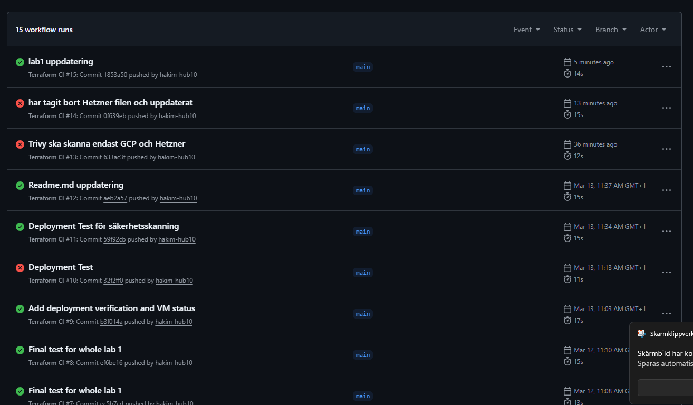
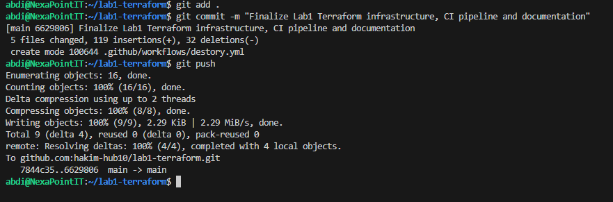
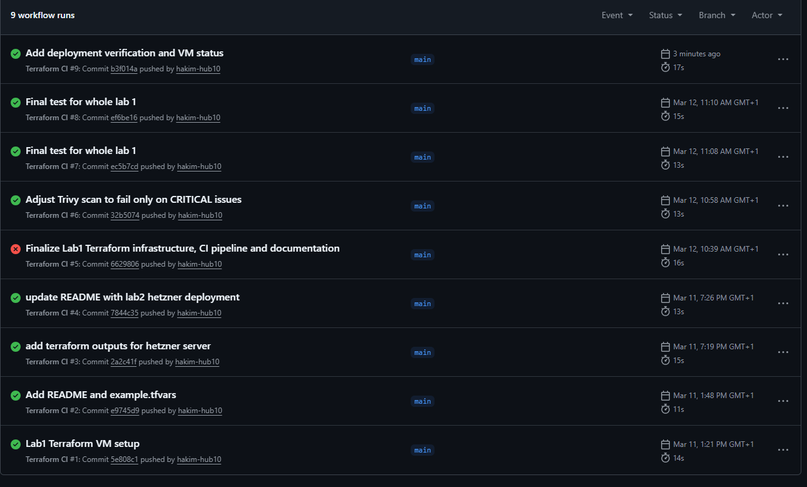
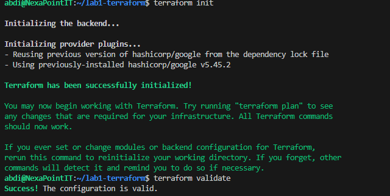
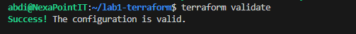
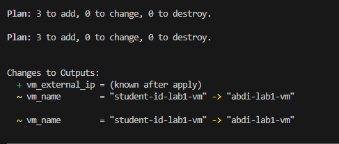
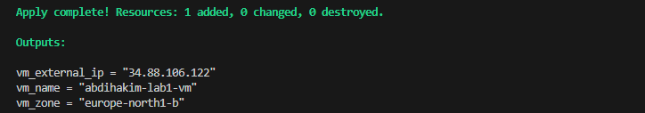
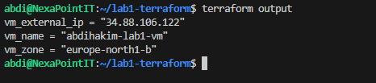

# DevSecOps Terraform Labs

This repository contains Terraform infrastructure developed during the DevSecOps course.

The goal is to demonstrate Infrastructure as Code, CI/CD validation pipelines, security scanning, and basic cloud security hardening.

# Lab 1 – Google Cloud VM

Terraform infrastructure that provisions a secure Linux virtual machine in Google Cloud.

## Infrastructure

The Terraform configuration deploys:

• Ubuntu 22.04 VM  
• External public IP address  
• Startup hardening script  
• Daily snapshot backup policy  

## Security Hardening

The startup script performs basic server hardening:

• UFW firewall configuration  
• Fail2ban intrusion prevention  
• Automatic security updates  
• Root SSH login disabled  

This improves the security posture of the deployed VM.

## CI Pipeline

A GitHub Actions pipeline automatically validates the Terraform code.

The pipeline performs:

• Terraform format check  
• Terraform configuration validation  
• Infrastructure security scanning (Trivy IaC)

This ensures that insecure infrastructure code cannot be merged.

## Disaster Recovery

A snapshot policy is configured using Terraform.

Backup strategy:

Daily automated disk snapshots.

### RPO (Recovery Point Objective)

24 hours

### RTO (Recovery Time Objective)

1 hour

Snapshots are retained for 7 days and can be used to restore the VM in case of failure.

## Deployment Result

The Terraform infrastructure was successfully deployed.

Terraform apply completed successfully and created the following resources:

• Google Cloud VM instance  
• Daily snapshot backup policy  
• Disk resource policy attachment  

The VM instance `abdihakim-lab1-vm` is running in zone `europe-north1-b`.

## Project Structure

lab1-terraform
│
├── main.tf
├── variables.tf
├── outputs.tf
├── startup.sh│
├── example.tfvars
├── README.md
└── .github/workflows

# Author

Abdihakim – DevSecOps Course Labs

2: CI Pipeline Runs
 

Terraform init

Terraform validate

Terraform plan
 

Terraform Apply

Terraform output
