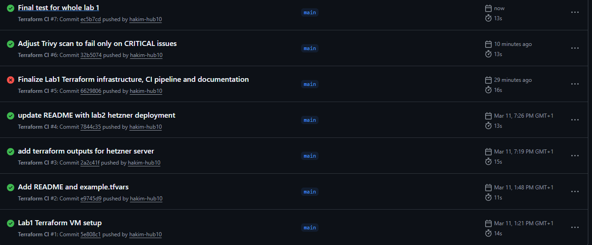

# DevSecOps Terraform Labs

This repository contains Terraform infrastructure developed during the DevSecOps course.

The goal is to demonstrate Infrastructure as Code, CI/CD validation pipelines, security scanning, and basic cloud security hardening.

# Lab 1 – Google Cloud VM

Terraform infrastructure that provisions a secure Linux virtual machine in Google Cloud.

## Infrastructure

The Terraform configuration deploys:

• Ubuntu 22.04 VM  
• External public IP address  
• Startup hardening script  
• Daily snapshot backup policy  

## Security Hardening

The startup script performs basic server hardening:

• UFW firewall configuration  
• Fail2ban intrusion prevention  
• Automatic security updates  
• Root SSH login disabled  

This improves the security posture of the deployed VM.

## CI Pipeline

A GitHub Actions pipeline automatically validates the Terraform code.

The pipeline performs:

• Terraform format check  
• Terraform configuration validation  
• Infrastructure security scanning (Trivy IaC)

This ensures that insecure infrastructure code cannot be merged.

## Disaster Recovery

A snapshot policy is configured using Terraform.

Backup strategy:

Daily automated disk snapshots.

### RPO (Recovery Point Objective)

24 hours

### RTO (Recovery Time Objective)

1 hour

Snapshots are retained for 7 days and can be used to restore the VM in case of failure.

# Lab 2 – Hetzner Cloud Deployment

Terraform infrastructure that provisions a virtual machine in Hetzner Cloud.

## Infrastructure

• Ubuntu 22.04 VM  
• Server type: CX23  
• Location: Helsinki  
• Startup script for server configuration  

## Terraform Output Example

Server name:

server_name = devsecops-lab

Retrieve the server IP:

terraform output server_ip

Example output:
server_ip = "PUBLIC_IP"

## Terraform Workflow

terraform init
terraform plan
terraform apply
terraform output

## Project Structure

lab1-terraform
│
├── main.tf
├── variables.tf
├── outputs.tf
├── startup.sh
│
├── hetzner
│   ├── main.tf
│   ├── variables.tf
│   └── outputs.tf
│
├── example.tfvars
├── README.md
└── .github/workflows

# Author

Abdihakim – DevSecOps Course Labs

2: Security scanning is configured to fail only on CRITICAL issues.
HIGH findings such as public VM IP are allowed since SSH access is required for the lab.

Terraform init

Terraform validate

Terraform plan
